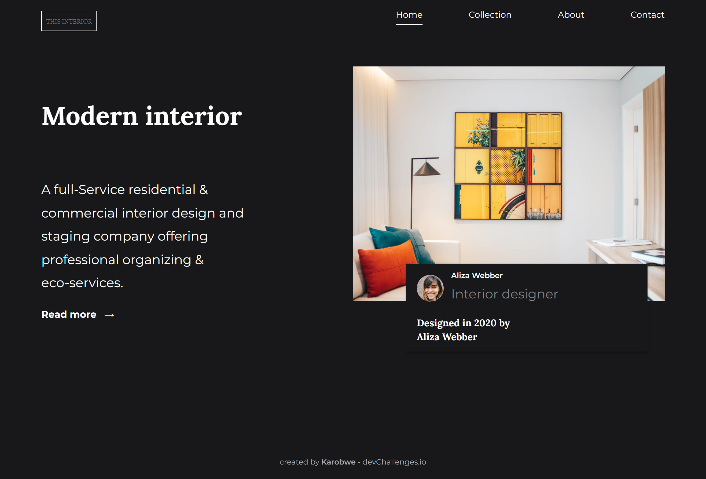

<!-- Please update value in the {}  -->

<h1 align="center">Interior Consultant</h1>

<div align="center">
   Solution for a challenge from  <a href="http://devchallenges.io" target="_blank">Devchallenges.io</a>.
</div>

<div align="center">
  <h3>
    <a href="https://vigilant-bell-9f7436.netlify.app/">
      Demo
    </a>
    <span> | </span>
    <a href="https://github.com/Karobwe/devchallenges-interior-consultant">
      Solution
    </a>
    <span> | </span>
    <a href="https://devchallenges.io/challenges/Jymh2b2FyebRTUljkNcb">
      Challenge
    </a>
  </h3>
</div>

<!-- TABLE OF CONTENTS -->

## Table of Contents

- [Overview](#overview)
  - [Built With](#built-with)
  - [Run in local](#run-in-local)
- [Features](#features)
- [Contact](#contact)
- [Acknowledgements](#acknowledgements)

<!-- OVERVIEW -->

## Overview



Checkout the live demo on [Netlify](https://vigilant-bell-9f7436.netlify.app/).

This time Encore helped me to organizing files but I lost lot of time on a problem I already met: script not loading because I forgot to include `runtime.js` and vendors script manually. 

### Built With

<!-- This section should list any major frameworks that you built your project using. Here are a few examples.-->

- [Webpack Encore](https://symfony.com/doc/current/frontend.html)
- [SASS](https://sass-lang.com/)
- Little bit of Vanilla Js

### Run in local

```shell
yarn install

# launch Encore's dev server
yarn dev-server

# load the project in local server
yarn start

# both last previous commands should be executed in two different terminal
```

## Features

<!-- List the features of your application or follow the template. Don't share the figma file here :) -->

This application/site was created as a submission to a [DevChallenges](https://devchallenges.io/challenges) challenge. The [challenge](https://devchallenges.io/challenges/Jymh2b2FyebRTUljkNcb) was to build an application to complete the given user stories.

## Acknowledgements

<!-- This section should list any articles or add-ons/plugins that helps you to complete the project. This is optional but it will help you in the future. For exmpale -->

- [How to increase the gap between text and underlining in CSS](https://stackoverflow.com/questions/1734618/how-to-increase-the-gap-between-text-and-underlining-in-css)
- [Holy Grid Guide](https://css-tricks.com/snippets/css/complete-guide-grid/)
- [Holy Flexbox Guide](https://css-tricks.com/snippets/css/a-guide-to-flexbox/)
- [Injecting a Line Break](https://css-tricks.com/injecting-line-break/)
- [Clamping a Number](https://css-tricks.com/snippets/sass/clamping-number/)

## Contact

- Website [your-website.com](https://karobwe.dev)
- GitHub [@your-username](https://github.com/Karobwe)
- Twitter [@your-twitter](https://twitter.com/Karobwe)
